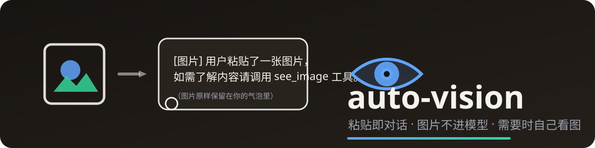

<p align="center">
  
</p>

<p align="center">
  <b>给纯文本 DeepSeek Harness 装上「眼睛」，同时挡住会让整条请求 400 的图片块。</b>
  <br/>
  贴图 → 气泡照常显示图片 → 模型收到文字说明 → 需要时自动调用 <code>see_image</code> 看图。
</p>

<p align="center">
  <a href="https://github.com/h-k-c/auto-vision"></a>
  <a href="https://github.com/h-k-c/auto-vision/blob/main/LICENSE"></a>
  = 18"/>
  
  
  
</p>

---

## 为什么需要它

DeepSeek 官方 API（以及 opencode-go / "Console Go" 等纯文本上游）**不收图**：
请求里的 image 块一旦被序列化成 `image_url`，上游直接拒绝**整条**请求：

```
Error from provider (Console Go): Failed to deserialize the JSON body into the
target type: messages[224]: unknown variant `image_url`, expected `text`
```

更糟的是：**历史里只要有图，之后每一条消息都会跟着报错**——因为整段历史会随每次请求重发。

大多数"看图插件"只解决"模型怎么看图"，**不解决这个问题**：你贴图后对话照样崩。auto-vision 先把这件事彻底解决，再给你完整的看图能力。

## 与"只装看图工具"的方案对比

| 场景 | 只装看图工具 | **auto-vision** |
| --- | --- | --- |
| 贴图后所有消息报 400（image_url） | ❌ 不解决 | ✅ `llm/stream` 自动清洗，请求里永远没有 image 块 |
| 气泡里正常显示原图 | ✅ | ✅ 只改请求副本、不改会话 |
| 模型按需看图（see_image 工具） | ✅ | ✅ 内置，默认开启 |
| 超限大图（>2048px） | ⚠️ 报错或需自行处理 | ✅ 自动按比例缩放（sips / ffmpeg / ImageMagick 可配） |
| 视觉源可换（本地 Ollama / 任意兼容 API） | 看实现 | ✅ 只改配置，不改代码 |
| 只想要"防崩"、不要看图 | ⚠️ 无法拆 | ✅ `tool: false` 一键关闭看图，清洗照常 |
| 安装复杂度 | 可能需多个包 + 依赖链 | ✅ 单包、零运行时依赖（仅 js-yaml） |

## 特性

- 🧹 **清洗（核心）**——`llm/stream` 瀑布最前面，把所有 image 块（含 tool-result 嵌套）替换为一句文字说明后重发；只对含图请求动手、只重入一次、不会死循环。
- 🖼️ **气泡零污染**——清洗只发生在"发往模型"的请求副本，会话原样保留，你看到的图片就是原图。
- 👁️ **see_image 看图工具**——调用任意 OpenAI chat/completions 兼容的**视觉模型 API**，默认魔搭免费档（Qwen3-VL，OCR 取字、UI 识别都够用），限流自动降级到备用模型。
- 📐 **超限自动缩放**——图片边长超过视觉 API 上限时，先用系统工具按比例缩放再发送（默认 macOS `sips`，`preprocessCommand` 可换 ffmpeg/ImageMagick），临时文件自动清理。
- ⚙️ **三级配置**——插件 config > 环境变量 > 默认值；视觉源不绑定任何厂商，换本地 Ollama 只改配置。
- 🔌 **单包零依赖**——不需要 Python、不需要额外服务进程；`llm`/`tools` 均为 DSH 核心服务。
- 🧪 **可测试**——`npm test` 11 项自包含单元测试（mock 网络与图片，不依赖运行时）。

## 工作原理

```
你粘贴图片
   │
   ▼
┌─────────────────────────────────────────────┐
│ agent/pre-step：记录最近图片路径（兜底用）      │
└─────────────────────────────────────────────┘
   │
   ▼
┌─────────────────────────────────────────────┐
│ llm/stream 瀑布最前面                        │
│  请求副本里的 image 块 ──► 一句文字说明         │
│  （会话/气泡原样不动）                        │
└─────────────────────────────────────────────┘
   │
   ▼
┌─────────────────────────────────────────────┐
│ 纯文本模型正常收到请求，不再 400               │
│   · 需要看图时：调用 see_image 工具            │
│   · 工具自动定位最近图片 → 视觉 API → 文字描述  │
│   · 超限图片先缩放再发送                       │
└─────────────────────────────────────────────┘
```

> 为什么"重新派发"而不是就地替换：`llm/stream` 的 waterfall 无法替换 payload
> （`next` 只透传原对象，且请求对象被 `deepFreeze`），所以采用"不调用 next、
> 用清洗后的请求重新走一遍 `llm.stream`"；清洗后的请求不再含 image 块，只会
> 重入一次，不会死循环。

## 快速开始

```bash
# 1. 安装（任选一种）
dsh plugin --profile web add github:h-k-c/auto-vision   # 从 GitHub 市场
npm install auto-vision                                  # 从 npm（发布后可用）

# 2. 配置视觉 API Key（需要看图时，三选一）
export VISION_API_KEY=sk-xxx                            # 或 MODELSCOPE_API_KEY / ZHIPU_API_KEY
# 或写入 ~/.dsh/.credentials.yaml 同名键

# 3. 重启 DSH
```

零配置也能用：只装不配 Key，**清洗功能照常工作**（模型不会因为贴图而崩），
只是模型看不到图的内容。

## 安装（详细）

方式一（GitHub 市场 / Registry）：

```bash
dsh plugin --profile web add github:h-k-c/auto-vision
```

方式二（npm）：

```bash
npm install auto-vision
# 然后拷到 DSH profile 的 node_modules 下，或在 profile 里以本地依赖方式引用
```

方式三（直接拷贝）：把本目录拷到你的 DSH profile 的 `node_modules` 下
（例如 `~/.dsh/profiles/web/node_modules/auto-vision/`）。

然后（所有方式都需要）在 profile 的 `cordis.patch.yml`（或等价组合文件）中插入：

```yaml
- insert:
    - id: auto-vision
      name: auto-vision
```

## 配置

优先级：**插件 config > 环境变量 > 默认值**。

| 配置键           | config 字段       | 环境变量                 | 默认值 |
| ---------------- | ----------------- | ------------------------ | ------ |
| 看图工具开关     | `tool`            | `VISION_TOOL`(0/false)   | `true` |
| API 地址         | `endpoint`        | `VISION_ENDPOINT`        | `https://api-inference.modelscope.cn/v1/chat/completions` |
| 模型列表         | `models`          | `VISION_MODEL`（单个）   | `[Qwen/Qwen3-VL-235B-A22B-Instruct, Qwen/Qwen3-VL-8B-Instruct]` |
| 高端模型别名     | `heavyModels`     | —                        | `{heavy: OpenGVLab/InternVL3_5-241B-A28B, internvl: 同}` |
| 最大输出 token   | `maxTokens`       | `VISION_MAX_TOKENS`      | `1500` |
| 图片大小上限     | `maxFileBytes`    | `VISION_MAX_FILE_BYTES`  | `10485760`（10MB） |
| 最长边长上限     | `maxDimension`    | `VISION_MAX_DIMENSION`   | `2048` |
| 缩放命令模板     | `preprocessCommand` | —                      | `['sips','-z','{height}','{width}','{input}','--out','{output}']` |
| 请求超时         | `timeoutMs`       | `VISION_TIMEOUT_MS`      | `60000` |
| API Key          | `apiKey`          | 见上文                   | 无 |
| 占位说明文本     | `note`            | `AUTO_VISION_NOTE`       | 内置中文说明 |
| 路径槽容量       | `maxLatestPaths`  | —                        | `20` |

config 示例（换本地 Ollama 只改配置，不改代码）：

```yaml
- id: auto-vision
  name: auto-vision
  config:
    endpoint: http://127.0.0.1:11434/v1/chat/completions
    models: [qwen2.5-vl:7b]
    tool: true
```

## 平台说明

- **macOS**：开箱即用（默认用系统自带 `sips` 缩放超限图片）。
- **Windows / Linux**：`sips` 不存在。缩放会失败并给出明确报错，此时请把
  `preprocessCommand` 配置为平台可用的缩放命令，例如：
  - ffmpeg：`['ffmpeg', '-y', '-i', '{input}', '-vf', 'scale={width}:{height}', '{output}']`
  - ImageMagick：`['magick', '{input}', '-resize', '{width}x{height}', '{output}']`
- 不需要看图（`tool: false`）时，无需任何视觉 API Key 与缩放工具，清洗功能
  照常工作。

## see_image 工具参数（模型视角）

- `file_path`（可省略）：图片绝对路径；省略时自动采用最近一张粘贴图。
- `question`（可省略）：想从图中提取的具体信息。
- `model`（可省略）：视觉模型 ID，或 `heavy` / `internvl` 高端别名。

## FAQ

**Q：贴图后所有消息都报 `unknown variant image_url`，怎么办？**
A：这正是本插件解决的。装好它，历史里的旧图也会在每次请求时被自动清洗，无需清空会话。

**Q：我只想解决报错，不想用视觉 API，行吗？**
A：行。`tool: false` 或 `VISION_TOOL=0` 关闭看图工具，清洗照常生效，连 Key 都不用配。

**Q：视觉模型用哪家的？要钱吗？**
A：默认魔搭（ModelScope）免费档 Qwen3-VL，配 `MODELSCOPE_API_KEY` 即可（魔搭有免费额度）。也可以换成任意 OpenAI 兼容端点，包括本地 Ollama。

**Q：图片会发给谁？**
A：只发给**你配置的视觉模型端点**（默认魔搭）。模型请求（DeepSeek 上游）永远不会收到图片块。

**Q：支持 Windows / Linux 吗？**
A：清洗与看图都支持；超限图片的自动缩放需要把 `preprocessCommand` 配成 ffmpeg 或 ImageMagick（见"平台说明"）。

## 开发与测试

```bash
npm install   # 安装依赖（js-yaml + dsh-tools peer）
npm test      # 11 项自包含单元测试
```

## 依赖的 DSH 约定

- 服务：`llm`（核心，必选）；`tools`（可选——缺席时看图工具不注册，
  清洗与记录照常工作）。
- 附件存储位置：`<DSH_HOME 或 ~/.dsh>/attachments/v1/objects/<hex[:2]>/<hex>`
  （DSH 内容寻址附件存储标准）。

## License

[MIT](LICENSE) · [Changelog](CHANGELOG.md)
